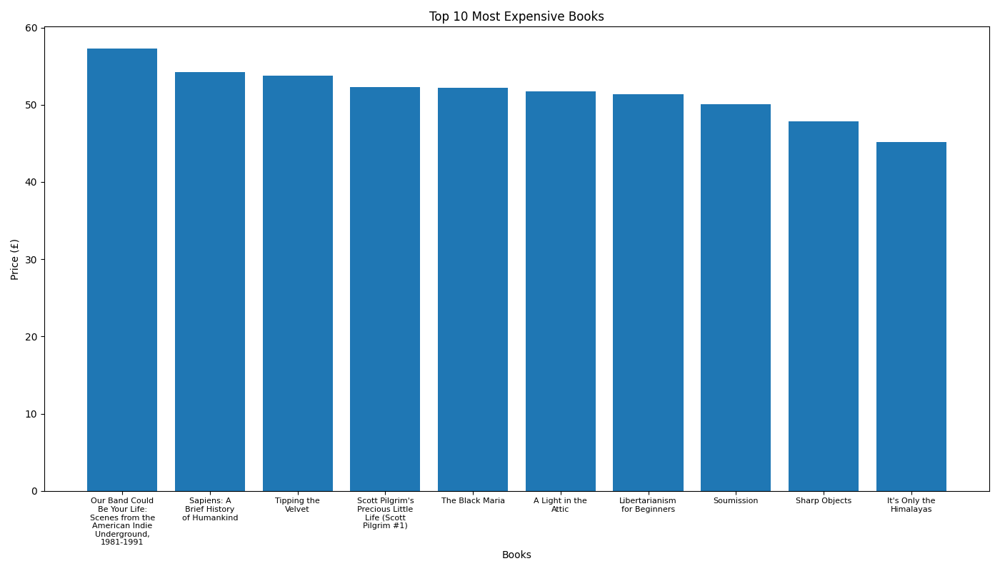

# book_web_scraping

Python web scraping project that collects book price data from a website and automatically generates Excel, chart, and PDF report outputs.

## Features

- Web scraping with Python
- Extract book titles and prices
- Export scraped data to Excel
- Generate price visualization chart
- Create automated PDF report

## Technologies

- Python
- Requests
- BeautifulSoup
- Pandas
- Matplotlib
- FPDF
- Excel

## Output Files

- book_prices.xlsx
- book_price_chart.png
- book_price_report.pdf

## Preview

